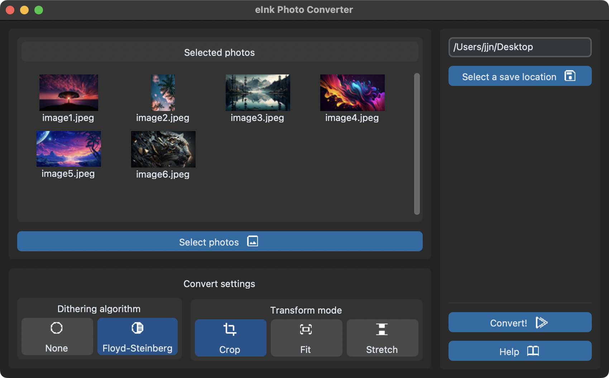

<p align="center">
  
</p>

# eInk Photo Converter

eInk Photo Converter is a GUI application for converting any photos into a format compatible with eInk screens. For now, it supports the [WaveShare 7-Color E-Paper E-Ink Display](https://www.waveshare.com/wiki/7.3inch_e-Paper_HAT_(F)_Manual#Overview), but in the future, I plan to add options to convert photos into more formats. Currently, the app converts images to 24-bit BMP with a 7-color palette. The application was written in Python using the [customtkinter](https://github.com/TomSchimansky/CustomTkinter) UI-library, conversion utilizes the Pillow library, and you can take a closer look at converter here: [Converter.py](https://github.com/TheFlashes/eInkPhotoConverter/blob/main/src/utils/Converter.py). I based my work on the converter used for [PhotoPainter](https://www.waveshare.com/wiki/PhotoPainter), however, I have made improvements and added new features.

## Installation

Ready-made binaries for Windows, MacOS, and Linux are available for download from the link below. The MacOS version is compiled for x86, as some libraries do not have fat binaries, which prevented me from creating a universal bundle. If you have a Mac with an M chip, I recommend downloading the source and compiling the application yourself with pyinstaller (The file with the specification can be found in the "pyinstaller" folder) or simply by running it using Python.

### [Download](https://github.com/TheFlashes/eInkPhotoConverter/releases)

## Running app from the source

1. Make sure you have Python version 3.10 or higher with the ***Tkinter module installed***
2. Download the source
   ```
   git clone https://github.com/TheFlashes/eInkPhotoConverter.git
   ```
3. Navigate to the project folder and install the dependencies.
   ```
   cd eInkPhotoConverter
   pip install -r requirements.txt
   ```
4. Navigate to the folder with the source code and run the app.
   ```
   cd src
   python3 main.py
   ```


